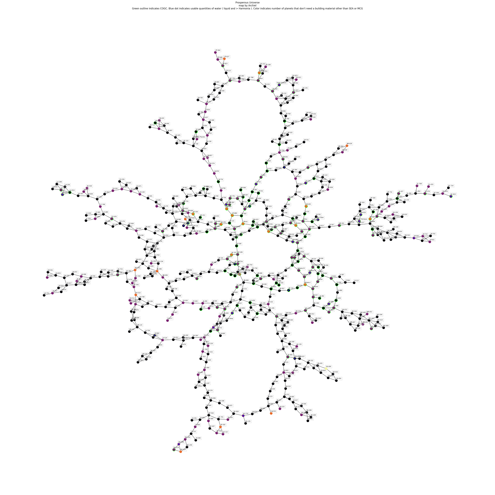

# PRUN-Planet-Mapper
A mapping tool for Prosperous Universe as a Jupyter notebook. Write custom filters in python to visualize the more complicated attributes of planets, and draw them to a human-readable map.

By Archiel of OOG

Installation:
Install Jupyter Notebook to use this.
https://jupyter.org/install

Data:
JSON data provided by FIO API: https://doc.fnar.net/
Thanks!

Sample output:
(open in new browser window to zoom and pan)

